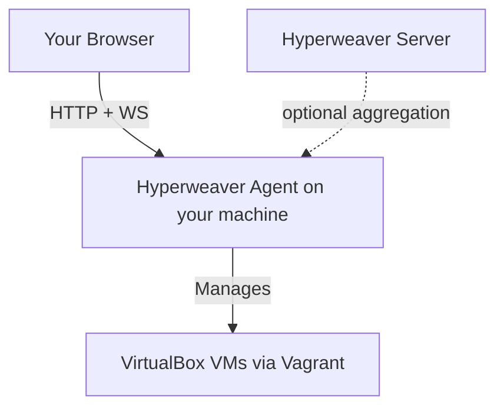

<p align="center">
  
</p>

# Hyperweaver Agent

**Hyperweaver Agent** is the VirtualBox/Vagrant host-agent of the Hyperweaver control plane, written in Go. It replaces Super.Human.Installer: a single background binary with a native system-tray icon that serves the Hyperweaver web UI to **your own browser** — no Electron, no embedded webview, no separate GUI shell.

## Overview

The agent follows the LedFx model: it runs quietly in the OS system tray (Windows notification area / macOS menu bar), hosts a local web server, and "Open" launches the management UI in your default browser (or the browser configured in `config.yaml`). The same binary exposes the shared **Agent API v1** contract, so a Hyperweaver Server can aggregate it alongside Zoneweaver Agents — or you run it 100% standalone (Direct mode), no server, no identity provider, nothing external.

### Current features

- **Native system tray**: app name + version, Open, Quit — the real OS tray, nothing custom.
- **Embedded Hyperweaver UI**: the published [hyperweaver-ui](https://github.com/MarkProminic/hyperweaver-ui) artifact is baked into release binaries and served at `/ui/` (docs at `/docs`).
- **Agent API v1 identity**: public `GET /api/status` advertising role, hypervisor, platform, and capability tokens.
- **Single binary per OS**: pure Go on Windows/Linux; macOS builds add only the tray's Cocoa bridge.

### Roadmap (see the platform architecture document)

Provisioning engine (SHI parity: `Hosts.yml` generation, `vagrant`/`VBoxManage` orchestration, role catalog with hash-verified installers), API-key auth with tray token handoff, VirtualBox VNC console over WebSocket, BoxVault integration, OIDC federation.

## Getting started

Grab an installer from the [releases page](https://github.com/Makr91/hyperweaver-agent/releases):

- **Windows**: `HyperweaverAgent-Setup.exe`
- **macOS**: `HyperweaverAgent-Setup.pkg`
- **Linux**: `hyperweaver-agent_<version>_amd64.deb` (or the bare-binary tarball)

Start the agent, click the tray icon, hit **Open**. On first run the agent writes a commented default configuration to your per-user config directory.

On Linux the same package works two ways: launch **Hyperweaver Agent** from the application menu for the tray experience (stock GNOME needs the AppIndicator extension to show tray icons), or run it headless as a service:

```bash
sudo systemctl enable --now hyperweaver-agent
journalctl -fu hyperweaver-agent
```

Service mode reads `/etc/hyperweaver-agent/config.yaml`; see [packaging/DEBIAN/README.md](packaging/DEBIAN/README.md).

## Configuration

| OS | Config file |
| --- | --- |
| Windows | `%AppData%\hyperweaver-agent\config.yaml` |
| macOS | `~/Library/Application Support/hyperweaver-agent/config.yaml` |
| Linux | `~/.config/hyperweaver-agent/config.yaml` |

```yaml
server:
  bind_address: 127.0.0.1   # keep loopback unless you want LAN access
  port: 9420

ui:
  enabled: true             # serve the web UI at /ui/
  path: ''                  # optional: serve UI from a directory instead of the embedded copy

browser:
  path: ''                  # optional: specific browser for "Open" (empty = system default)

logging:
  level: info               # error | warn | info | debug
  console: true
  file: ''                  # empty = <config dir>/logs/agent.log
  max_size_mb: 20
  max_backups: 5
```

Flags: `--config <path>`, `--headless` (no tray), `--version`.

## Building from source

Requires Go 1.24+. Two binary assets come from the UI project so the tray icon matches the web favicon — copy them once:

```bash
cp ../hyperweaver-ui/public/favicon.ico internal/tray/assets/icon.ico
cp ../hyperweaver-ui/public/images/logo192.png internal/tray/assets/icon.png
```

Then:

```bash
go mod tidy
go build -o hyperweaver-agent .
```

Development builds serve a placeholder page at `/ui/`. To bundle the real UI, unpack a [hyperweaver-ui release artifact](https://github.com/MarkProminic/hyperweaver-ui/releases) into `internal/webui/dist/` before building (release CI does this automatically), or point `ui.path` at an unpacked copy.

For UI development, copy the SPA build into the (gitignored) `ui/` folder and point `ui.path` at it — the agent serves it from disk, so UI changes never require a Go rebuild:

```bash
cd ../hyperweaver-ui && npm run build && cp -r dist/. ../hyperweaver-agent/ui/
```

```yaml
ui:
  path: G:\Projects\hyperweaver-agent\ui   # in your per-user config.yaml
```

Cross-compile the Windows binary from any OS:

```bash
GOOS=windows GOARCH=amd64 CGO_ENABLED=0 go build -ldflags "-H=windowsgui -s -w" -o hyperweaver-agent.exe .
```

macOS binaries must be built on macOS (the tray uses Apple's Cocoa API); CI handles that.

## Architecture



The Hyperweaver platform: **Hyperweaver UI** (shared React SPA) · **Hyperweaver Agent** (this repo, Go, VirtualBox/Vagrant) · **Zoneweaver Agent** (Node, Bhyve/OmniOS) · **Hyperweaver Server** (aggregator) · **BoxVault** (box registry) · **BoxPress** (box builder).

## Contributing

Contributions welcome — see [CONTRIBUTING.md](CONTRIBUTING.md).

## License

GPL-3.0 — see [LICENSE.md](LICENSE.md).
