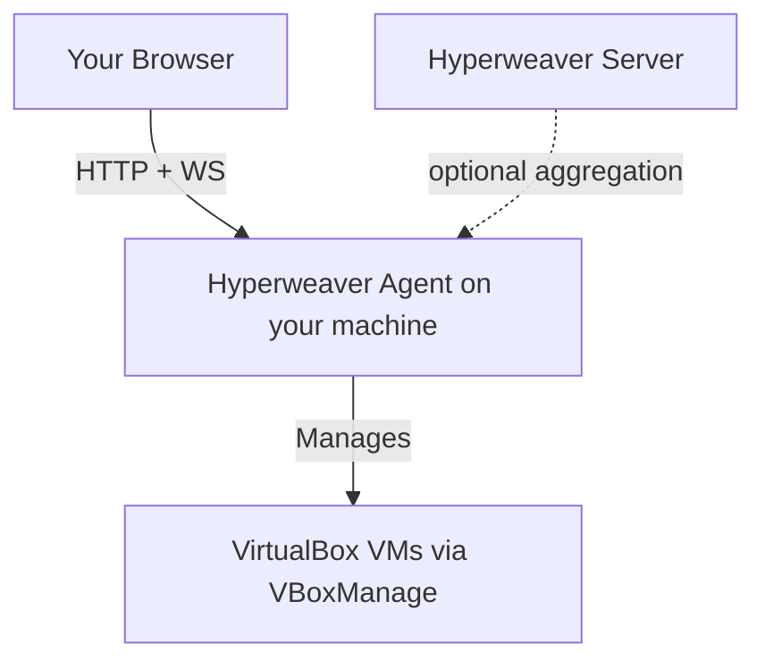

<p align="center">
  
</p>

# Hyperweaver Agent

**Hyperweaver Agent** is the VirtualBox host-agent of the Hyperweaver control plane, written in Go. It replaces Super.Human.Installer: a single background binary with a native system-tray icon that serves the Hyperweaver web UI to **your own browser** — no Electron, no embedded webview, no separate GUI shell.

## Overview

The agent follows the LedFx model: it runs quietly in the OS system tray (Windows notification area / macOS menu bar), hosts a local web server, and "Open" launches the management UI in your default browser (or the browser configured in `app.config.yaml`). The same binary exposes the shared **Agent API v1** contract, so a Hyperweaver Server can aggregate it alongside Zoneweaver Agents — or you run it 100% standalone (Direct mode), no server, no identity provider, nothing external.

### Current features

- **Native system tray**: app name + version, Open, a Troubleshooting submenu (Open Log File, Open Config Folder, Open Data Folder, Restart Agent), Quit — the real OS tray, nothing custom.
- **Embedded STARTcloud UI**: the published [startcloud-ui](https://github.com/STARTcloud/startcloud-ui) artifact, the one shared UI of the estate, is baked into release binaries and served at `/` (docs at `/docs`, the API under `/api`).
- **Agent API v1 identity**: public `GET /api/status` advertising role, hypervisor, platform, and capability tokens.
- **Provisioning engine**: `Hosts.yml` generation, native `VBoxManage` machine creation and orchestration through the task queue, the SHI-format provisioner package registry and catalog install, hash-verified installer artifacts. Vagrant is never executed; externally created Vagrant projects are discovered read-only.
- **API-key auth with tray token handoff**: `POST /api/api-keys/bootstrap`, `POST /api/auth/tray-claim`, the `hwa://open` protocol link (the scheme names `hyperweaver-agent` and `com.startcloud.hyperweaver-agent` are accepted in its place).
- **Machine consoles**: SSH terminal sessions, the VNC websockify bridge (`GET /api/machines/{name}/vnc/websockify`), the browser-RDP bridge (`GET /api/machines/{name}/rdp-bridge`), framebuffer screenshots.
- **BoxVault integration**: box-template registry with remote registry discovery (`GET /api/templates/sources`, `GET /api/templates/remote/{source}`), seeded with STARTcloud BoxVault.
- **OIDC federation**: RFC 8628 device login and the loopback silent flow (`/api/auth/oidc/*`), advertised as `oidc` in `GET /api/status` when `oidc.enabled`.
- **Single binary per OS**: pure Go on Windows/Linux; macOS builds add only the tray's Cocoa bridge.

## Getting started

Grab an installer from the [releases page](https://github.com/Makr91/hyperweaver-agent/releases):

- **Windows**: `HyperweaverAgent-Setup.exe`
- **macOS**: `HyperweaverAgent-Setup.pkg`
- **Linux**: `hyperweaver-agent_<version>_amd64.deb` (or the bare-binary tarball)

Start the agent, click the tray icon, hit **Open**. On first run the agent seeds the five configuration files into your per-user config directory.

On Linux the same package works two ways: launch **Hyperweaver Agent** from the application menu for the tray experience (stock GNOME needs the AppIndicator extension to show tray icons), or run it headless as a service:

```bash
sudo systemctl enable --now hyperweaver-agent
journalctl -fu hyperweaver-agent
```

Service mode reads the configuration directory `/etc/hyperweaver-agent`; see [packaging/DEBIAN/README.md](packaging/DEBIAN/README.md).

## Configuration

The configuration is a directory of five files: `app.config.yaml`, `auth.config.yaml`, `db.config.yaml`, `machines.config.yaml`, `storage.config.yaml`. The directory is `CONFIG_DIR` when set, else the per-user configuration directory; `--config <dir>` names another.

| OS | Config directory |
| --- | --- |
| Windows | `%AppData%\hyperweaver-agent\` |
| macOS | `~/Library/Application Support/hyperweaver-agent/` |
| Linux | `~/.config/hyperweaver-agent/` |

On a desktop run a missing file is seeded from `internal/config/seed/<name>.config.yaml`. Four of the seeds are only:

```yaml
schemaVersion: 1
```

`storage.config.yaml` is seeded as:

```yaml
schemaVersion: 1
template_sources:
  sources:
    startcloud_boxvault:
      display_name: STARTcloud BoxVault
      url: https://boxvault.startcloud.com
      enabled: true
      default: true
catalog_sources:
  sources:
    startcloud_catalog:
      display_name: STARTcloud Provisioner Catalog
      url: https://provisioner-catalog.startcloud.com/catalog.json
      enabled: true
      default: true
```

Every other key takes its default from the file's schema in `internal/config/schema/<name>.schema.yaml`; the shared UI edits each file at `/admin/config/<name>` and `GET /api/config/<name>/schema` serves the schema.

Flags: `--config <dir>`, `--headless` (no tray), `--version`.

## Building from source

Requires Go 1.26.6 (the `go` line of `go.mod`). The tray icon assets under `internal/tray/assets/` are committed and embedded at build time; nothing is copied before a build.

```bash
go mod tidy
go build -o hyperweaver-agent .
```

Development builds serve a placeholder page at `/`. To bundle the real UI, unpack a [startcloud-ui release artifact](https://github.com/STARTcloud/startcloud-ui/releases) into `internal/webui/dist/` before building (release CI does this automatically, pinned by `packaging/config/ui-version.yaml`), or point `ui.path` at an unpacked copy.

For UI development, copy the SPA build into the (gitignored) `ui/` folder and point `ui.path` at it — the agent serves it from disk, so UI changes never require a Go rebuild:

```bash
cd ../startcloud-ui && npm run build && cp -r dist/. ../hyperweaver-agent/ui/
```

In your per-user `app.config.yaml`:

```yaml
ui:
  path: G:\Projects\hyperweaver-agent\ui
```

Cross-compile the Windows binary from any OS:

```bash
GOOS=windows GOARCH=amd64 CGO_ENABLED=0 go build -ldflags "-H=windowsgui -s -w" -o hyperweaver-agent.exe .
```

macOS binaries must be built on macOS (the tray uses Apple's Cocoa API); CI handles that.

## Architecture


```mermaid
graph TD
    A[Your Browser] -- HTTP + WS --> B[Hyperweaver Agent on your machine];
    B -- Manages --> C[VirtualBox VMs via VBoxManage];
    D[Hyperweaver Server] -. optional aggregation .-> B;
```

The Hyperweaver platform: **STARTcloud UI** (the shared React SPA) · **Hyperweaver Agent** (this repo, Go, VirtualBox via VBoxManage) · **Zoneweaver Agent** (Node, Bhyve/OmniOS) · **Hyperweaver Server** (aggregator) · **BoxVault** (box registry) · **BoxPress** (box builder).

## Contributing

Contributions welcome — see [CONTRIBUTING.md](CONTRIBUTING.md).

## License

GPL-3.0 — see [LICENSE.md](LICENSE.md).
